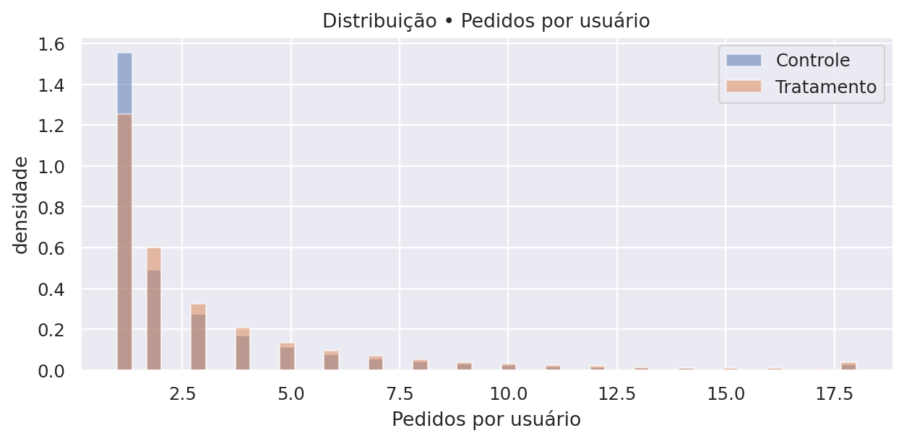
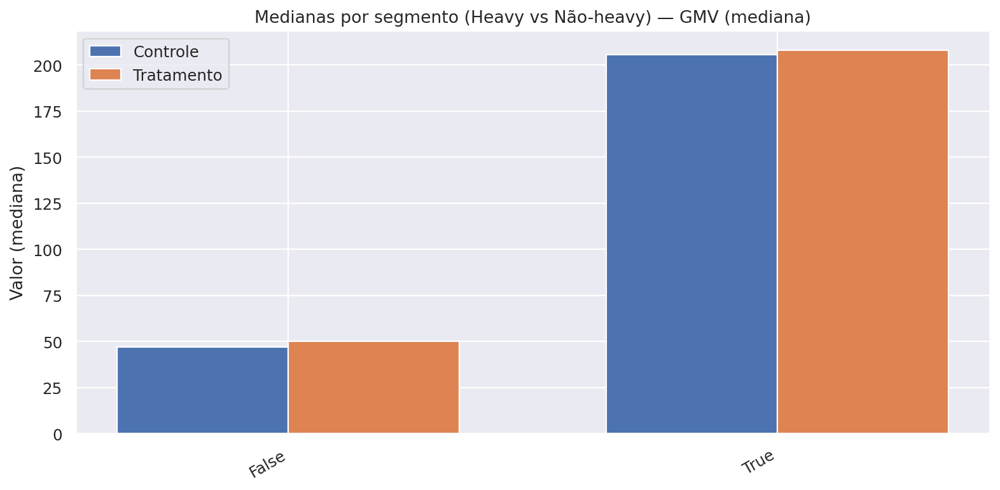
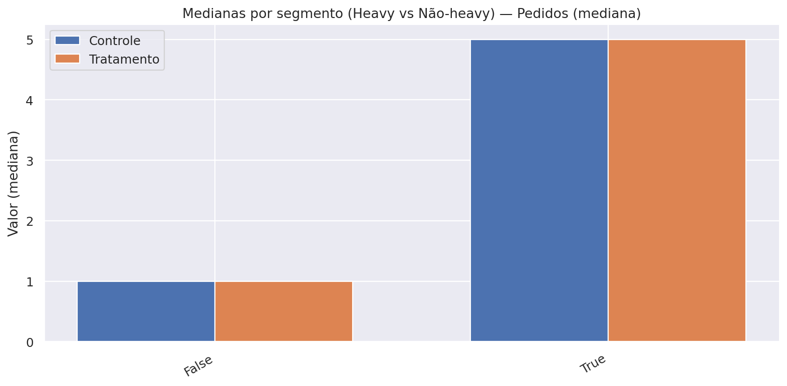
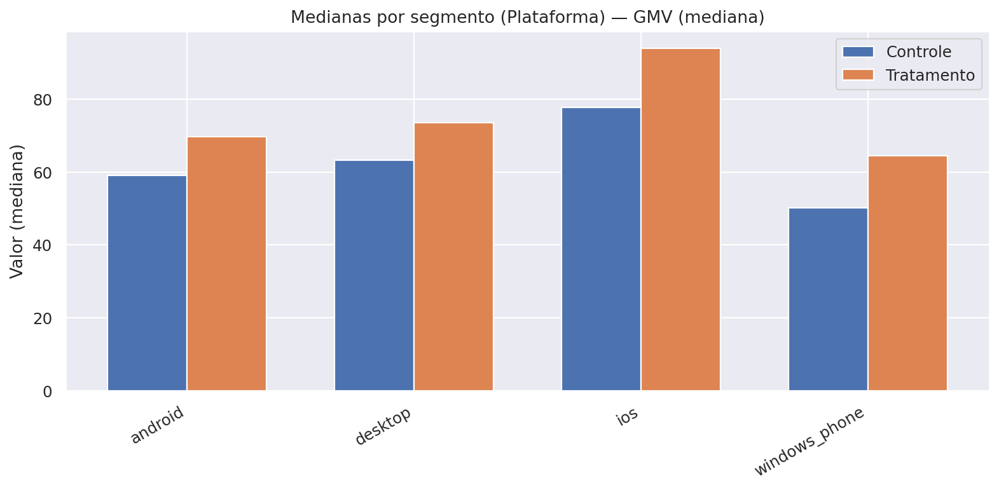

# Case iFood: Teste A/B de Cupons

## 1. Contexto
O iFood testou uma campanha de cupons com um grupo de usuários selecionados (grupo teste), enquanto outro grupo similar não recebeu o benefício (grupo controle).  
O objetivo do experimento foi avaliar se o cupom aumentaria o engajamento e o gasto dos usuários, além de verificar a viabilidade financeira da iniciativa.

**Glossário**
- **Mediana:** valor típico por cliente (menos sensível a casos extremos).
- **p95:** nível alto esperado (apenas ~5% dos clientes ficam acima disso).
- **Heavy users (≥3):** parcela de clientes frequentes.
- **Tratamento:** grupo que recebeu o cupom.
- **Controle:** grupo que não recebeu o cupom.
- **AOV:** ticket médio por pedido.
---

## 2. Principais Resultados da Campanha

### 2.1 Engajamento e Vendas

**Tabela 1 – Sumário por grupo (medianas, p95 e heavy users).**  

| Grupo | Usuários | Mediana GMV | Mediana pedidos | Mediana AOV | p95 GMV | p95 pedidos | p95 AOV | % Heavy Users (≥3) |
|---:|---:|---:|---:|---:|---:|---:|---:|---:|
| Sem Cupom | 357261 | 66.2 | 1 | 40.85 | 457.40 | 9 | 100.6 | 30.71% |
| Com Cupom | 442676 | **79.8★** | **2★** | 41.00 | 507.19 | 10 | 99.80 | 36.93% |

> **Notas:** 
> **★** = diferença estatisticamente significativa vs. Controle (teste **Mann–Whitney**, p < 0,05). 

- **Pedidos por usuário**: aumento de **+100%** no grupo que recebeu o cupom.
- **GMV por usuário (valor gasto no app)**: crescimento de **+20%** com o cupom.
- **Ticket médio (AOV)**: permaneceu estável, em torno de **R\$100 por pedido**.
- **Heavy users (≥3 pedidos no período)**: cresceram de **31%** para **37%** com o cupom.

**Figura 1 – Medianas por grupo (GMV, Pedidos, AOV).**  

**Figura 2 – Distribuição de pedidos por usuário (controle vs tratamento).**  

**Figura 3 – Boxplots (robustos a outliers) por grupo.**  
a) GMV por usuário  
  

b) Pedidos por usuário  
  

c) AOV por usuário  
     

**Interpretação:**  
O cupom não aumentou o valor de cada pedido, mas levou os usuários a **pedirem com mais frequência**, elevando o gasto total.  
Isso reforça o cupom como alavanca de engajamento e hábito de consumo, e não como impulsionador de ticket médio.

---

### 2.2 Sustentabilidade Financeira

Premissas adotadas:  
    - Valor do cupom: **R$10**, pago pelo iFood.  
    - Taxa de uso do cupom: **30%**.  
    - Comissão média do iFood (take rate): **23%** sobre o valor dos pedidos.  

- **Receita incremental total (comissões adicionais):** R$1,74 milhão.  
- **Custo total dos cupons concedidos:** R$1,33 milhão.  
- **Lucro incremental total (receita − custo):** R$416 mil.  
- **Lucro incremental por usuário tratado:** R$0,94.  
- **LTV (valor estimado de longo prazo por cliente):** R$34,6.  
- **CAC (custo de aquisição via cupom):** R$10.  
- **Relação LTV/CAC:** 3,5 → saudável.  
- **ROI (%) ≈ 31,35%**

**Tabela 2 – Indicadores financeiros (base).**

| Métrica                         | Valor          |
|---                              |---             |
| Receita incremental total       | R$1,74 milhão  |
| Custo total dos cupons          | R$1,33 milhão  |
| **Lucro incremental total**     | **R$416 mil**  |
| **Lucro incremental por usuário** | **R$0,94**   |
| LTV                             | R$34,6         |
| CAC                             | R$10           |
| LTV/CAC                         | 3,5            |
| **ROI (%)**                     | **31,35%**     |

> **Break-even (geral do A/B)**
> Precisa: **R\$ 13,04** | Entregou: **R\$ 17,13** | Gap: **+R\$ 4,09**  
> **Lucro por usuário:** **R\$ 0,94** | **Status:** **OK**

**Nota sobre o LTV:**  
O cálculo do LTV (Lifetime Value) é normalmente utilizado em horizontes mais longos, acompanhando a evolução do cliente ao longo de vários meses ou anos. No nosso caso, os dados disponíveis cobrem apenas o período do experimento, de modo que o LTV foi aqui estimado a partir desse intervalo restrito.  
Mesmo assim, a métrica foi incluída porque oferece uma boa referência de potencial de retorno por cliente e permite compará-lo com o CAC. Ou seja, ainda que a estimativa seja mais conservadora e não capture todo o ciclo de vida real do cliente, ela ajuda a reforçar a análise de viabilidade financeira no contexto deste case.

**Interpretação:**  
O investimento em cupons trouxe **retorno positivo** para o iFood.  
Cada real gasto com cupons gerou aproximadamente **R\$3,50 de valor de cliente a longo prazo**, indicando uma estratégia financeiramente sustentável.

---

### 2.3. Conclusões
- A campanha de cupons foi **bem-sucedida em aumentar a frequência de pedidos e o GMV por usuário**.  
- O ticket médio permaneceu estável, mas o maior engajamento levou a uma **receita incremental relevante**.  
- Financeiramente, a ação se mostrou **viável e sustentável**, com ROI positivo e excelente relação **LTV/CAC**.  
- O cupom deve ser entendido como uma alavanca de **engajamento e recorrência**, mais do que de aumento de ticket médio.

---

### 2.4. Recomendações e Nova Proposta de Teste A/B

Os resultados da análise mostraram que os cupons, da forma como foram aplicados, aumentaram o número de pedidos e o GMV, mas não alteraram o valor médio por pedido (AOV). Além disso, observamos que até usuários com alto engajamento (heavy users) utilizaram os cupons, o que reduz a eficiência da campanha.

Diante disso, recomendamos **ajustes na estratégia** antes de repetir a ação:

#### 1. Segmentação mais inteligente
- **Evitar heavy users**: clientes que já compram frequentemente tendem a usar o cupom, mas não aumentam seu gasto médio. Assim, o investimento não gera valor incremental.
- **Foco em clientes inativos ou de baixa frequência**: direcionar cupons a esse grupo pode aumentar a base ativa e gerar maior retorno sobre o investimento.

#### 2. Diferenciar o tipo de cupom
- **Cupom com gasto mínimo**: exemplo, "R\$10 de desconto para compras acima de R\$40”. Esse modelo incentiva aumento do ticket médio, combatendo o resultado neutro que vimos no AOV.
- **Frete grátis**: alternativa que pode ser mais atrativa em alguns perfis de consumidores e incentivar novas compras.

#### 3. Nova proposta de teste A/B
Para validar essas hipóteses, sugere-se um desenho de experimento com três grupos:

- **Grupo Controle**: sem cupom.  
- **Grupo 1**: cupom fixo de \$10 com gasto mínimo de R\$40.  
- **Grupo 2**: cupom de frete grátis com gasto mínimo de R\$30.  

**Público-alvo do teste:** clientes inativos ou de baixa frequência.

#### 4. Métricas de avaliação
- **Pedidos por usuário** (engajamento).  
- **GMV incremental** (crescimento de receita).  
- **ROI da campanha** (retorno financeiro líquido).  
- **Taxa de reativação** (quantos clientes voltaram a comprar).  

Com essa abordagem, será possível avaliar se os cupons funcionam não apenas como incentivo imediato, mas também como alavanca de crescimento sustentável para o negócio.

---

## 3. Segmentação de usuários

### 3.1. Critérios de segmentação e racional

**Objetivo.** Agrupar clientes com comportamentos semelhantes para direcionar benefício, mensagem e canal, aumentando engajamento/retenção e otimizando custo de cupom.

**Critérios utilizados:**
- **Frequência (Heavy user):**  
  - *Definição*: **heavy** (≥ 3 pedidos no período) vs **não-heavy** (< 3).  
  - *Racional*: frequência é um preditor direto de valor; separar quem já tem hábito de compra de quem ainda está “em formação”.
- **Plataforma de origem:** **Android**, **iOS** e **Desktop**.  
  - *Racional*: o comportamento por dispositivo/canal difere (tamanho do ticket, fricção de checkout, jornada).
- **RFM (Recency–Frequency–Monetary):** códigos **111–555** (1=baixo, 5=alto em cada eixo).  
  - *Racional*: permite distinguir desde “recente-pouco-baixo ticket” (ex.: 111) até “recente-muito-alto ticket” (ex.: 555) para graduar o incentivo.
- **Novo vs recorrente:** sinalizamos **novo** quando disponível, porém, na base utilizada, o volume de “novo” é residual (amostra focada em quem já comprou). Mantemos como **exploratório** até incorporar usuários que ainda não pediram (para medir 1ª compra de fato).

---

### 3.2. Resultados do A/B por segmento e recomendações

**1) Frequência (Heavy vs Não-heavy)**  

**Tabela 3 – Medianas por segmento (Heavy vs Não-heavy) + métricas financeiras**

| Segmento   | Usuários (Trat., amostra) | Usuários (Trat., base) | GMV mediano (Ctrl → Trat) | Δ GMV | Pedidos medianos (Ctrl → Trat) | Δ Pedidos | AOV mediano (Ctrl → Trat) | Δ AOV | Receita inc. total (R$) | Custo total (R$) | Lucro inc. total (R$) | Lucro por usuário (R$) |
|---|---:|---:|---:|---:|---:|---:|---:|---:|---:|---:|---:|---:|
| Não-heavy  | 34.929 | 279.181 | 47,00 → 50,00 | **+3,00**★ | 1 → 1 | 0 | 40,09 → 40,45 | **+0,37** | 200.754 | 837.543 | **-636.789** | **-2,28** |
| Heavy      | 20.439 | 163.495 | 205,60 → 208,20 | **+2,60** | 5 → 5 | 0 | 42,30 → 42,30 | **+0,00** | 33.120 | 490.485 | **-457.365** | **-2,80** |

> **Notas:** 
> • Valores marcados com **★** indicam **diferença estatisticamente significativa** entre Tratamento e Controle dentro do segmento (teste **Mann–Whitney**, p < 0,05). Em Não-heavy, embora a **mediana de pedidos** permaneça 1→1, o teste indica diferença na **distribuição** de pedidos. 
> • As **medianas** (GMV/pedidos/AOV) foram calculadas sobre **amostra**; os “Usuários (Trat., amostra)” refletem o tamanho coletado.  
> • As **métricas financeiras** (receita, custo, lucro, lucro por usuário) foram calculadas **sobre 100% da base** por segmento; por isso mostramos também “Usuários (Trat., base)”.

> **Break-even (Frequência)**  
> **Não-heavy:** Precisa **R\$ 13,04** | Entregou **R\$ 3,13** | Gap **−R\$ 9,91** | **Lucro/usuário −R\$ 2,28** → **NEG**  
> **Heavy:** Precisa **R\$ 13,04** | Entregou **R\$ 0,88** | Gap **−R\$ 12,16** | **Lucro/usuário −R\$ 2,80** → **NEG**

**Figura 4 - Mediana GMV/AOV/Pedidos por usuário (Heavy vs Não-heavy)**

a) GMV por usuário
  
b) AOV por usuário
  
c) Pedidos por usuário

O cupom **não altera de forma relevante o comportamento típico** (medianas) dentro de cada grupo:
- **Não-heavy**: GMV/usuário mediano sobe **+R\$3,00** (47,0 → 50,0), com **pedidos medianos estáveis** (1 → 1) e **AOV praticamente estável** (+R\$0,37).
- **Heavy (≥3)**: **efeito marginal** em GMV mediano (**+R\$2,60**; 205,6 → 208,2); **pedidos medianos estáveis** (5 → 5) e **AOV estável**.

* **Composição importa** 
O grupo Tratamento tem **mais heavy** (**~37%** vs **~31%** no Controle, +6 p.p.). Essa diferença de mix **eleva as médias globais** do tratado mesmo quando as **medianas por grupo mudam pouco**. 

* **Implicações financeiras** 
Com as premissas atuais (23% de take rate, cupom R\$10, resgate 30%), o **lucro incremental por usuário** é **negativo** em ambos:
- **Não-heavy:** **−R\$2,28/usuário** (total −R\$636,8 mil).  
- **Heavy:** **−R\$2,80/usuário** (total −R\$457,4 mil).  
→ Sinal de **canibalização**/ineficiência com o **valor** e/ou **gatilho** atuais quando olhamos só por frequência.

- O cupom **não move a mediana de pedidos** (1 → 1 em não-heavy; 5 → 5 em heavy); o ganho que existe acontece **fora do centro** (cauda), insuficiente para pagar o custo em cada grupo isolado.
- Como a **composição** do Tratamento tem mais heavy, o agregado pode parecer melhor, mas a **política por frequência pura** (heavy vs não-heavy) **não se paga** com o desenho atual.

**Ações sugeridas:**
1. **Não-heavy (1–2 pedidos):** manter cupom **direcionado**, mas com **gatilho de progressão** (ex.: após o 1º pedido, ou após X dias sem compra) para empurrar ao **3º pedido**.  
2. **Heavy (≥3):** **reduzir valor/frequência** do cupom (ou condicionar a novos comportamentos, p.ex., categorias menos frequentes), **evitando canibalização**.
3. **Rebalancear a composição** em próximos testes: usar **randomização estratificada por heavy** ou **reponderar** o resultado global para o mix do Controle, deixando o efeito mais comparável.

**KPIs a acompanhar:**
- **% de heavy users (≥3)** no período (progressão de frequência).  
- **GMV mediano por usuário** em **não-heavy**.  
- **Lucro incremental por usuário** por grupo (objetivo: ≥ 0 sob as premissas vigentes).  

**2) Plataforma (Android / iOS / Desktop)**  

**Tabela 4 – Medianas por segmento (Plataforma) + métricas financeiras**

| Plataforma | Usuários (Trat., amostra) | Usuários (Trat., base) | GMV mediano (Ctrl → Trat) | Δ GMV | Pedidos medianos (Ctrl → Trat) | Δ Pedidos | AOV mediano (Ctrl → Trat) | Δ AOV | Receita inc. total (R$) | Custo total (R$) | Lucro inc. total (R$) | Lucro por usuário (R$) |
|---|---:|---:|---:|---:|---:|---:|---:|---:|---:|---:|---:|---:|
| Android | 23.632 | 189.796 | 59,00 → 69,80 | **+10,80**★ | 1 → 2 | **+1**★ | 38,57 → 38,67 | **+0,10** | 609.238 | 569.388 | **39.850** | **0,21** |
| Desktop | 7.939  | 63.370  | 63,20 → 73,60 | **+10,40**★ | 1 → 2 | **+1**★ | 39,33 → 39,43 | **+0,10** | 305.302 | 190.110 | **115.192** | **1,82** |
| iOS     | 23.336 | 185.497 | 77,80 → 94,00 | **+16,20**★ | 2 → 2 | 0  | 44,90 → 45,00 | **+0,10** | 808.417 | 556.491 | **251.926** | **1,36** |

> **Notas:**  
> • Valores marcados com **★** indicam **diferença estatisticamente significativa** entre Tratamento e Controle dentro do segmento (teste **Mann–Whitney**, p < 0,05). **AOV** não apresentou diferenças significativas nos segmentos mostrados.
> • As **medianas** (GMV/pedidos/AOV) vêm da **amostra**; “Usuários (Trat., amostra)” reflete o tamanho coletado.  
> • As **métricas financeiras** foram calculadas **sobre 100% da base**; por isso mostramos “Usuários (Trat., base)”.
> • **Windows Phone:** este segmento foi **omitido** da tabela por ter **pouquíssimos usuários** no Tratamento/Controle, o que gera **estimativas instáveis** (alta variância) e risco de leitura equivocada. 

> **Break-even (Plataforma)**  
> **Desktop:** Precisa **R\$ 13,04** | Entregou **R\$ 20,95** | Gap **+R\$ 7,91** | **Lucro/usuário R\$ 1,82** → **OK**  
> **iOS:** Precisa **R\$ 13,04** | Entregou **R\$ 18,95** | Gap **+R\$ 5,91** | **Lucro/usuário R\$ 1,36** → **OK**  
> **Android:** Precisa **R\$ 13,04** | Entregou **R\$ 13,96** | Gap **+R\$ 0,91** | **Lucro/usuário R\$ 0,21** → **No limite**  
> **Windows Phone:** Entregou **R\$ 10,46** | Gap **−R\$ 2,58** | **Lucro/usuário −R\$ 0,59** → **NEG (N pequeno)**

**Figura 5 - Mediana GMV/AOV/Pedidos por usuário (Plataforma)**

a) GMV por usuário

b) AOV por usuário

c) Pedidos por usuário

**Figura 6 - Heavy Users por Plataforma**

- **Android:** em **mediana**, GMV/usuário **+R\$10,80** (59,0 → 69,8), **pedidos** sobem **1 → 2**, **AOV** estável **(+R\$0,10)**.  
  **Heavy rate**: ~**+6,1 p.p.** (28,6% → 34,7%).  
  **Financeiro (100% da base):** **lucro/usuário ≈ R$ +0,21**.

- **Desktop:** em **mediana**, GMV/usuário **+R\$10,40** (63,2 → 73,6), **pedidos** sobem **1 → 2**, **AOV** estável **(+R\$0,10)**.  
  **Heavy rate**: ~**+6,7 p.p.** (28,9% → 35,6%).  
  **Financeiro:** **lucro/usuário ≈ R$ +1,82**.

- **iOS:** em **mediana**, GMV/usuário **+R\$16,20** (77,8 → 94,0), **pedidos** estáveis **(2 → 2)**, **AOV** estável **(+R\$0,10)**.  
  **Heavy rate**: ~**+6,7 p.p.** (33,0% → 39,7%).  
  **Financeiro:** **lucro/usuário ≈ R$ +1,36**.

**Ações sugeridas:**  
- **Priorizar** esforço em **Desktop** e **iOS** (melhor retorno por usuário, com AOV estável).  
- Em **Android**, manter a alavanca, mas **testar cupom menor e/ou gatilhos mais precisos** (ex.: 2º carrinho, pós-hiato) para **elevar o lucro por usuário**.

**KPIs a acompanhar:**
* **lucro/usuário ≥ 0** por plataforma
* **GMV mediano** por usuário
* **% de heavy users (≥3)**
* **taxa de uso do cupom**, mantendo **AOV estável**.

**3) RFM (111–555)**  

**Tabela 5 – RFM (Top 5 por população do Tratado, medianas + AOV)**

| RFM | Usuários (Trat.) | GMV mediano (Ctrl → Trat) | Δ GMV | Pedidos medianos (Ctrl → Trat) | Δ Pedidos | AOV mediano (Ctrl → Trat) | Δ AOV |
|---|---:|---:|---:|---:|---:|---:|---:|
| 555 | 5.391 | 409,3 → 415,2 | **+5,9** | 9 → 9 | 0 | 47,10 → 46,94 | **−0,16** |
| 111 | 3.192 | 25,2 → 25,9   | **+0,7** | 1 → 1 | 0 | 25,20 → 25,90 | **+0,70** |
| 112 | 2.904 | 44,0 → 44,5   | **+0,5** | 1 → 1 | 0 | 44,00 → 44,50 | **+0,50** |
| 211 | 2.310 | 25,1 → 25,0   | **−0,1** | 1 → 1 | 0 | 25,10 → 25,00 | **−0,10** |
| 455 | 2.054 | 343,6 → 332,8 | **−10,8** | 7 → 7 | 0 | 46,72 → 45,64 | **−1,08** |

> **Notas:**
> • A grade RFM tem **muitas células** (até **125**). Várias têm **N pequeno**, o que torna estimativas de **ROI voláteis**.
> • O objetivo da RFM aqui é **direcionamento** (quem merece mais/menos incentivo). 
> • As **medianas** (GMV/pedidos/AOV) vêm da **amostra**; “Usuários (Trat., amostra)” reflete o tamanho coletado.
> • **Top-5 por população**: não houve diferenças estatisticamente significativas entre Tratamento e Controle nas células apresentadas (Mann–Whitney, p ≥ 0,05).

- Dentro de cada célula, as mudanças em **medianas** são, em geral, **pequenas** (Δ GMV mediano baixo; **Δ Ped mediano = 0** em todas as top-5).
- Há células de **alto valor** (ex.: **555**) com ganho discreto de GMV mediano, e outras com **Δ negativo** (ex.: **455**), sugerindo **canibalização/ineficiência** em partes da grade.
- O ganho global observado no agregado vem muito de **composição de mix** (maior participação de células de valor alto no Tratamento) e não de grandes mudanças “dentro” de cada célula.

**Ações sugeridas**

- **Baixo RFM (11\*, 21\*, 31\*)**: cupom **mais agressivo** e com **gatilhos de progressão** (empurrar **1→2→3** pedidos).
- **Médio RFM (4\*4, 45\*)**: cupom **moderado**, focado em **frequência** (evitar **Δ AOV** negativo).
- **Alto RFM (54\*, 55\*)**: cupom **baixo/ocasional** ou **condicionado** (categorias novas, horários frios), para **evitar canibalização**; atenção às células com **Δ GMV/AOV negativos** (ex.: **455**).

**KPIs a acompanhar:**

- **Progressão de faixa RFM** (movimento das caixinhas de baixo → médio → alto).
- **Frequência mediana** nas faixas baixas.
- **Δ GMV mediano ≥ 0** e **AOV estável** dentro das células priorizadas.

**4) Novo vs Recorrente (limitação atual)**  

**Tabela 6 – Medianas (Novo vs Recorrente)**

| Segmento | Usuários (Trat.) | GMV mediano (Ctrl → Trat) | Δ GMV | Pedidos medianos (Ctrl → Trat) | Δ Pedidos |
|---|---:|---:|---:|---:|---:|
| Recorrente | 55.348 | 66,00 → 79,60 | **+13,60** | 1 → 2 | **+1** |

- **O que vimos:** clientes novos não existem na amostra, pois a base completa contém apenas usuários com ao menos um pedido anterior ao período de análise, então a “conversão=1,0” é espúria.  
- **O que fazer:** incluir **usuários sem pedido** na base de teste (grupo de controle e tratado) para medir **1ª compra**; só então definir política específica para “novos”.

---

### 3.3. Recomendações para Segmentação

**Frequência (Heavy vs Não-heavy)**  
- **Não-heavy (1–2 pedidos):** manter cupom **direcionado** com **gatilhos de progressão** (pós-1º/2º pedido; reativação após X dias).  
- **Heavy (≥3):** cupom **baixo/ocasional** ou **condicionado** (categorias/horários frios), para **evitar canibalização**.

**Plataforma**  
- **Desktop e iOS:** **priorizar** (boa resposta em mediana); manter *capping* para não diluir margem.  
- **Android:** manter a alavanca, mas **testar cupom menor** e/ou **mínimo de carrinho** (ex.: “R\$10 off ≥ R\$40”) e **gatilhos** (2º carrinho, reativação 7–14 dias, abandono).

**RFM**  
- Usar **tiers agregados** (Baixo / Médio / Alto) em vez de 125 células.  
- **Baixo/Médio:** incentivo para **frequência** (1→2→3). **Alto:** incentivo **seletivo/ocasional**, evitando gastar onde o hábito já existe.

**Métricas por segmento**  
- **GMV mediano por usuário** e **% heavy (≥3)**; monitorar **p95** para oportunidades de topo sem queda de **AOV**.

---

## 4. Próximos Passos 

**Como interpretar o break-even**  
Com as premissas atuais (take rate 23%, cupom R\$10, uso 30%), o cupom **só se paga** se cada usuário tratado gerar **≥ R$ 13,04** de **vendas extras** no período.

**Quadro – Break-even por célula (resumo)**

| Célula        | Precisa | Entregou | Gap  | Lucro/usuário | Status |
|---|---:|---:|---:|---:|:--:|
| Geral         | 13,04 | 17,13 | +4,09 | 0,94 | OK |
| Android       | 13,04 | 13,96 | +0,91 | 0,21 | No limite |
| Desktop       | 13,04 | 20,95 | +7,91 | 1,82 | OK |
| iOS           | 13,04 | 18,95 | +5,91 | 1,36 | OK |
| Não-heavy     | 13,04 | 3,13  | −9,91 | −2,28 | NEG |
| Heavy         | 13,04 | 0,88  | −12,16| −2,80 | NEG |

**Regras práticas (farol sem emojis)**  
- **OK**: *Entregou* ≥ **R$ 13,04** **e** **Lucro/usuário ≥ 0** → **manter/escala**.  
- **No limite**: diferença para **R$ 13,04** < **R$ 2,00** → **ajustar** (valor menor, mínimo de carrinho, gatilhos).  
- **NEG**: *Entregou* < **R$ 13,04** → **pausar ou recalibrar**.  
**Checkpoints:** avaliar **semanal/quinzenal**; se uma célula ficar **NEG por 2 leituras seguidas** com **N tratado ≥ 1.000**, **suspender** até novo desenho.

**Sinalização de ação**  
- **Escalar**: **Desktop** e **iOS** (boa folga sobre o break-even).  
- **Calibrar**: **Android** (cupom menor e/ou mínimo de carrinho; gatilhos de intenção/reativação; foco em não-heavy).  
- **Restringir**: **Heavy** (ocasional/condicional) e **Windows Phone** (N pequeno e negativo).

