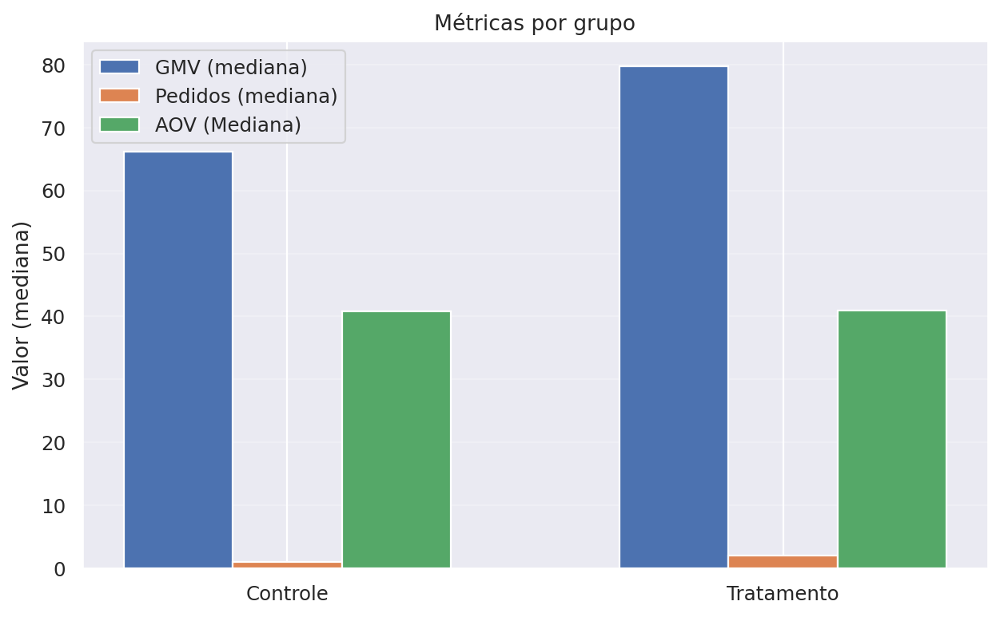
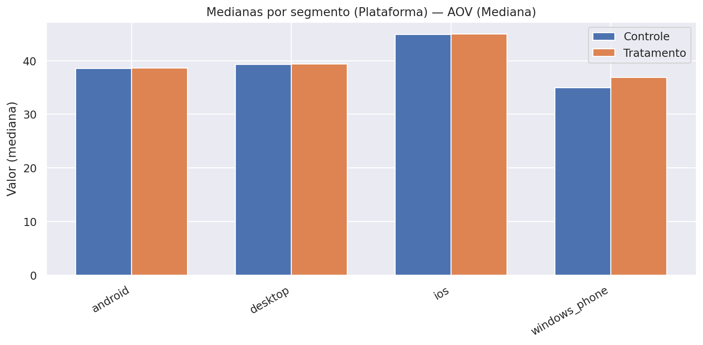

# Case iFood: Teste A/B de Cupons

## 1. Contexto
O iFood testou uma campanha de cupons com um grupo de usuários selecionados (grupo teste), enquanto outro grupo similar não recebeu o benefício (grupo controle).  
O objetivo do experimento foi avaliar se o cupom aumentaria o engajamento e o gasto dos usuários, além de verificar a viabilidade financeira da iniciativa.

**Período amostrado:** Janela inferida de 01-01-2029 a 01-02-2019, desconsiderando registros isolados fora desse período (quantis 1–99%).

**Glossário**
- **Mediana:** valor típico por cliente (menos sensível a casos extremos).
- **p95:** nível alto esperado (apenas ~5% dos clientes ficam acima disso).
- **Heavy users (≥3):** parcela de clientes frequentes, com pelo menos 3 pedidos no período.
- **Tratamento:** grupo que recebeu o cupom.
- **Controle:** grupo que não recebeu o cupom.
- **AOV:** ticket médio por pedido.
- **GMV:** valor total gasto pelos usuários.
---

## 2. Principais Resultados da Campanha

### 2.1 Engajamento e Vendas

**Tabela 1 – Sumário por grupo (medianas, p95 e heavy users).**  

| Grupo | Usuários | Mediana GMV | Mediana pedidos | Mediana AOV | p95 GMV | p95 pedidos | p95 AOV | % Heavy Users (≥3) |
|---:|---:|---:|---:|---:|---:|---:|---:|---:|
| Sem Cupom | 357261 | 66.2 | 1 | 40.85 | 457.40 | 9 | 100.6 | 30.71% |
| Com Cupom | 442676 | **79.8★** | **2★** | 41.00 | 507.19 | 10 | 99.80 | 36.93% |

> **Notas:** 
> **★** = diferença estatisticamente significativa versos Controle (teste **Mann–Whitney**, p < 0,05). 

- **Pedidos por usuário**: aumento de **+100%** no grupo que recebeu o cupom.
- **GMV por usuário (valor gasto no app)**: crescimento de **+20%** com o cupom.
- **Ticket médio (AOV)**: permaneceu estável, em torno de **R\$100 por pedido**.
- **Heavy users (≥3 pedidos no período)**: cresceram de **31%** para **37%** com o cupom.

**Figura 1 – Medianas por grupo (GMV, Pedidos, AOV).**  

**Figura 2 – Distribuição de pedidos por usuário (controle vs tratamento).**  

**Figura 3 – Boxplots (medianas) por grupo.**  
a) GMV por usuário  
  

b) Pedidos por usuário  
  

c) AOV por usuário  
     

**Interpretação:**  
O cupom não aumentou o valor de cada pedido, mas levou os usuários a **pedirem com mais frequência**, elevando o gasto total.  
Isso reforça o cupom como alavanca de engajamento e hábito de consumo, e não como impulsionador de ticket médio.

---

### 2.2 Sustentabilidade Financeira

Premissas adotadas:  
    - Valor do cupom: **R$10**, pago pelo iFood.  
    - Taxa de uso do cupom: **30%**.  
    - Comissão média do iFood (take rate): **23%** sobre o valor dos pedidos.  

**Tabela 2 – Indicadores financeiros.**

| Métrica                         | Valor          |
|---                              |---             |
| Receita incremental total       | R$1,74 milhão  |
| Custo total dos cupons          | R$1,33 milhão  |
| **Lucro incremental total**     | **R$416 mil**  |
| **Lucro incremental por usuário** | **R$0,94**   |
| LTV                             | R$34,6         |
| CAC                             | R$10           |
| LTV/CAC                         | 3,5            |
| **ROI (%)**                     | **31,35%**     |

> **Break-even (geral do A/B)**
> Necessário: **R\$ 13,04** | Entregou: **R\$ 17,13** | Gap: **+R\$ 4,09**  
> **Lucro por usuário:** **R\$ 0,94** | **Status:** **OK**

**Nota sobre o LTV:**  
O cálculo do LTV (Lifetime Value) é normalmente utilizado em horizontes mais longos, acompanhando a evolução do cliente ao longo de vários meses ou anos. Na análise, os dados disponíveis cobrem apenas o período do experimento, de modo que o LTV foi aqui estimado a partir desse intervalo restrito.  
Ainda assim, a métrica foi incluída porque oferece uma boa referência de potencial de retorno por cliente e permite compará-lo com o CAC. Ou seja, ainda que a estimativa seja mais conservadora e não capture todo o ciclo de vida real do cliente, ela ajuda a reforçar a análise de viabilidade financeira no contexto deste case.

**Interpretação:**  
O investimento em cupons trouxe **retorno positivo** para o iFood.  
Cada real gasto com cupons gerou aproximadamente **R\$3,50 de valor de cliente a longo prazo**, indicando uma estratégia financeiramente sustentável.

---

### 2.3. Conclusões
- A campanha de cupons foi **bem-sucedida em aumentar a frequência de pedidos e o GMV por usuário**.  
- O ticket médio permaneceu estável, mas o maior engajamento levou a uma **receita incremental relevante**.  
- Financeiramente, a ação se mostrou **viável e sustentável**, com ROI positivo e excelente relação **LTV/CAC**.  
- O cupom deve ser entendido como uma alavanca de **engajamento e recorrência**, mais do que de aumento de ticket médio.

---

### 2.4. Recomendações e Nova Proposta de Teste A/B

Os resultados da análise mostraram que os cupons, da forma como foram aplicados, aumentaram o número de pedidos e o GMV, mas não alteraram o valor médio por pedido (AOV). Além disso, foi observado que usuários com alto engajamento (heavy users) utilizaram os cupons, o que reduz a eficiência da campanha.

Diante disso, recomendam-se **ajustes na estratégia** antes de repetir a ação:

#### 1. Segmentação mais inteligente
- **Evitar heavy users**: clientes que já compram frequentemente tendem a usar o cupom, mas não aumentam seu gasto médio. Assim, o investimento não gera valor incremental.
- **Foco em clientes inativos ou de baixa frequência**: direcionar cupons a esse grupo pode aumentar a base ativa e gerar maior retorno sobre o investimento.

#### 2. Diferenciar o tipo de cupom
- **Cupom com gasto mínimo**: exemplo, "R\$10 de desconto para compras acima de R\$40”. Esse modelo incentiva aumento do ticket médio, combatendo o resultado neutro visto no AOV.
- **Frete grátis**: alternativa que pode ser mais atrativa em alguns perfis de consumidores e incentivar novas compras.

#### 3. Nova proposta de teste A/B
Para validar essas hipóteses, sugere-se um desenho de experimento com três grupos:

- **Grupo Controle**: sem cupom.  
- **Grupo 1**: cupom fixo de \$10 com gasto mínimo de R\$40.  
- **Grupo 2**: cupom de frete grátis com gasto mínimo de R\$30.  

**Público-alvo do teste:** clientes inativos ou de baixa frequência.

#### 4. Métricas de avaliação
- **Pedidos por usuário** (engajamento).  
- **GMV incremental** (crescimento de receita).  
- **ROI da campanha** (retorno financeiro líquido).  
- **Taxa de reativação** (quantos clientes voltaram a comprar).  

Com essa abordagem, será possível avaliar se os cupons funcionam não apenas como incentivo imediato, mas também como alavanca de crescimento sustentável para o negócio.

---

## 3. Segmentação de usuários

### 3.1. Critérios de segmentação e racional

**Objetivo.** Agrupar clientes com comportamentos semelhantes para direcionar benefício, mensagem e canal, aumentando engajamento/retenção e otimizando custo de cupom.

**Critérios utilizados:**
- **Frequência (Heavy user):**  
  A **análise de frequência de pedidos** divide os clientes em dois grupos: **não-heavy** (menos de 3 pedidos no período) e **heavy** (3 ou mais pedidos). A ideia é verificar se o cupom tem efeito diferente em clientes ocasionais, que ainda estão em fase de adoção do hábito, em comparação com clientes já engajados, que compram frequentemente. Esse corte simples ajuda a avaliar se os cupons estão incentivando progressão de frequência ou apenas sendo utilizados por usuários que já comprariam de qualquer forma.
- **Plataforma de origem:** **Android**, **iOS** e **Desktop**.  
  A análise por **plataforma de uso** considera que o comportamento do cliente pode variar dependendo do canal de compra (app Android, app iOS ou versão Desktop). Fatores como usabilidade, jornada de checkout e perfil socioeconômico influenciam tanto o ticket médio quanto a sensibilidade ao desconto. Avaliar o resultado por plataforma permite entender onde o cupom gera mais retorno financeiro e onde pode estar operando no limite da viabilidade.
- **RFM (Recency–Frequency–Monetary):**  
  A análise de **RFM (Recency, Frequency, Monetary)** é uma técnica clássica de segmentação de clientes, que classifica os usuários de acordo com três dimensões: **recência da última compra (R)**, **frequência de pedidos (F)** e **valor gasto (M)**. Cada dimensão é escalonada de 1 (baixo) a 5 (alto), gerando até 125 combinações possíveis (ex.: 111 = clientes pouco recentes, baixa frequência e baixo gasto; 555 = clientes muito recentes, com alta frequência e alto gasto). Essa granularidade permite identificar quais perfis respondem melhor ao cupom e quais tendem a gerar canibalização. No entanto, como muitas células têm poucos usuários, a análise aqui destaca apenas as cinco células mais populosas do grupo tratado, oferecendo uma visão mais estável e representativa do comportamento observado.

- **Novo vs recorrente:** 
A análise de **novos vs recorrentes** busca entender se os cupons funcionam de forma diferente para quem nunca comprou no iFood (novos) e para quem já tem histórico de pedidos (recorrentes). Essa distinção é importante porque o cupom pode atuar tanto como ferramenta de **aquisição** (atrair o cliente para a 1ª compra) quanto de retenção (estimular clientes existentes a comprar mais vezes). No entanto, na base deste experimento, não havia clientes totalmente novos, já que os dados contemplavam apenas usuários com pelo menos um pedido anterior. Por isso, essa segmentação aparece aqui apenas como **exploratória**, a ser aprofundada em futuros testes que incluam de fato usuários sem histórico.

---

### 3.2. Resultados do A/B por segmento e recomendações

**1) Frequência (Heavy vs Não-heavy)**  

**Tabela 3 – Medianas por segmento (Heavy vs Não-heavy) + métricas financeiras**

| Segmento   | Usuários (Trat., amostra) | Usuários (Trat., base) | GMV mediano (Ctrl → Trat) | Δ GMV | Pedidos medianos (Ctrl → Trat) | Δ Pedidos | AOV mediano (Ctrl → Trat) | Δ AOV | Receita inc. total (R$) | Custo total (R$) | Lucro inc. total (R$) | Lucro por usuário (R$) |
|---|---:|---:|---:|---:|---:|---:|---:|---:|---:|---:|---:|---:|
| Não-heavy  | 34.929 | 279.181 | 47,00 → 50,00 | **+3,00**★ | 1 → 1 | 0 | 40,09 → 40,45 | +0,37 | 200.754 | 837.543 | -636.789 | -2,28 |
| Heavy      | 20.439 | 163.495 | 205,60 → 208,20 | +2,60 | 5 → 5 | 0 | 42,30 → 42,30 | +0,00 | 33.120 | 490.485 | -457.365 | -2,80 |

> **Notas:** 
> • **★** indica **diferença estatisticamente significativa** entre Tratamento e Controle dentro do segmento (teste **Mann–Whitney**, p < 0,05). Em Não-heavy, embora a **mediana de pedidos** permaneça 1→1, o teste indica diferença na **distribuição** de pedidos. 
> • As **medianas** (GMV/pedidos/AOV) foram calculadas sobre **amostras** retiradas da base completa; os “Usuários (Trat., amostra)” refletem o tamanho coletado.  
> • As **métricas financeiras** (receita, custo, lucro, lucro por usuário) foram calculadas **sobre 100% da base** por segmento.

> **Break-even (Frequência)**  
> **Não-heavy:** Necessário **R\$ 13,04** | Entregou **R\$ 3,13** | Gap **−R\$ 9,91** | **Lucro/usuário −R\$ 2,28** → **NEG**  
> **Heavy:** Necessário **R\$ 13,04** | Entregou **R\$ 0,88** | Gap **−R\$ 12,16** | **Lucro/usuário −R\$ 2,80** → **NEG**

**Figura 4 - Mediana GMV/AOV/Pedidos por usuário (Heavy vs Não-heavy)**

a) GMV por usuário
  
b) AOV por usuário
  
c) Pedidos por usuário

**Interpretação:**
O cupom **não altera de forma relevante o comportamento típico** (medianas) dentro de cada grupo:
- **Não-heavy**: GMV/usuário mediano sobe **+R\$3,00** (47,0 → 50,0), com **pedidos medianos estáveis** (1 → 1) e **AOV praticamente estável** (+R\$0,37).
- **Heavy (≥3)**: aumento em GMV mediano (**+R\$2,60**; 205,6 → 208,2), mas sem significância estatística; **pedidos medianos estáveis** (5 → 5) e **AOV estável**.

**Composição importa**
O grupo Tratamento tem **mais heavy** (**~37%** vs **~31%** no Controle, +6 p.p.). Essa diferença de mix **eleva as médias globais** do tratado mesmo quando as **medianas por grupo mudam pouco**. 

**Implicações financeiras**
Com as premissas atuais (23% de take rate, cupom R\$10, resgate 30%), o **lucro incremental por usuário** é **negativo** em ambos:
- **Não-heavy:** **−R\$2,28/usuário** (total −R\$636,8 mil).  
- **Heavy:** **−R\$2,80/usuário** (total −R\$457,4 mil).  

Isto pode indicar **canibalização**/ineficiência com o **valor** e/ou **gatilho** atuais quando apenas a frequência é considerada.
O cupom **não move a mediana de pedidos** (1 → 1 em não-heavy; 5 → 5 em heavy). O pequeno ganho observado vem de **poucos clientes específicos com gasto acima da média**, o que é **insuficiente** para compensar o custo quando olhamos o grupo como um todo.
Como a **composição** do Tratamento possui mais heavy users, o agregado pode parecer melhor, mas a **política por frequência pura** (heavy vs não-heavy) **não se paga** com o desenho atual.

**Ações sugeridas:**

1. **Não-heavy (1–2 pedidos):** manter cupom **direcionado**, mas com **gatilho de progressão** (ex.: após o 1º pedido, ou após X dias sem compra) para conduzir usuário ao **3º pedido**.
2. **Heavy (≥3):** **reduzir valor/frequência** do cupom (ou condicionar a novos comportamentos, por exemplo, categorias menos frequentes), **evitando canibalização**.
3. **Equilibrar os grupos de teste:** assegurar que **controle e tratamento tenham proporções semelhantes de heavy e não-heavy**. Isso evita distorções no resultado global e permite avaliar com clareza o impacto real dos cupons.

**KPIs a acompanhar:**
- **% de heavy users (≥3)** no período (progressão de frequência).  
- **GMV mediano por usuário** em **não-heavy**.  
- **Lucro incremental por usuário** por grupo (objetivo: ≥ 0 sob as premissas vigentes).  

**2) Plataforma (Android / iOS / Desktop)**  

**Tabela 4 – Medianas por segmento (Plataforma) + métricas financeiras**

| Plataforma | Usuários (Trat., amostra) | Usuários (Trat., base) | GMV mediano (Ctrl → Trat) | Δ GMV | Pedidos medianos (Ctrl → Trat) | Δ Pedidos | AOV mediano (Ctrl → Trat) | Δ AOV | Receita inc. total (R$) | Custo total (R$) | Lucro inc. total (R$) | Lucro por usuário (R$) |
|---|---:|---:|---:|---:|---:|---:|---:|---:|---:|---:|---:|---:|
| Android | 23.632 | 189.796 | 59,00 → 69,80 | **+10,80**★ | 1 → 2 | **+1**★ | 38,57 → 38,67 | +0,10 | 609.238 | 569.388 | 39.850 | 0,21 |
| Desktop | 7.939  | 63.370  | 63,20 → 73,60 | **+10,40**★ | 1 → 2 | **+1**★ | 39,33 → 39,43 | +0,10 | 305.302 | 190.110 | 115.192 | 1,82 |
| iOS     | 23.336 | 185.497 | 77,80 → 94,00 | **+16,20**★ | 2 → 2 | 0  | 44,90 → 45,00 | +0,10 | 808.417 | 556.491 | 251.926 | 1,36 |

> **Notas:**  
> • **★** indica **diferença estatisticamente significativa** entre Tratamento e Controle dentro do segmento (teste **Mann–Whitney**, p < 0,05). 
> • As **medianas** (GMV/pedidos/AOV) vêm de **amostras** da base de dados; “Usuários (Trat., amostra)” reflete o tamanho coletado.  
> • As **métricas financeiras** foram calculadas **sobre 100% da base**.
> • **Windows Phone:** este segmento foi **omitido** da tabela por ter **pouquíssimos usuários** no Tratamento/Controle, o que gera **estimativas instáveis** (alta variância) e risco de leitura equivocada. 

> **Break-even (Plataforma)**  
> **Desktop:** Necessário **R\$ 13,04** | Entregou **R\$ 20,95** | Gap **+R\$ 7,91** | **Lucro/usuário R\$ 1,82** → **OK**  
> **iOS:** Necessário **R\$ 13,04** | Entregou **R\$ 18,95** | Gap **+R\$ 5,91** | **Lucro/usuário R\$ 1,36** → **OK**  
> **Android:** Necessário **R\$ 13,04** | Entregou **R\$ 13,96** | Gap **+R\$ 0,91** | **Lucro/usuário R\$ 0,21** → **No limite**  
> **Windows Phone:** Entregou **R\$ 10,46** | Gap **−R\$ 2,58** | **Lucro/usuário −R\$ 0,59** → **NEG (N pequeno)**

**Figura 5 - Mediana GMV/AOV/Pedidos por usuário (Plataforma)**

a) GMV por usuário

b) AOV por usuário

c) Pedidos por usuário

**Figura 6 - Heavy Users por Plataforma**

**Interpretação**

A análise por plataforma mostra que o efeito do cupom não foi homogêneo entre os usuários:

* **Android**: os usuários aumentaram o GMV mediano em cerca de **R\$10,80**, e passaram de **1 para 2 pedidos no período**. O ticket médio (AOV) permaneceu estável, e a proporção de heavy users cresceu em torno de **+6 p.p.**. Apesar desses sinais positivos de engajamento, o retorno financeiro líquido foi praticamente nulo (**≈R\$0,21 por usuário**). Isso indica que, embora o cupom tenha gerado comportamento mais ativo, o ganho incremental ainda é muito baixo para compensar o custo do incentivo.

* **Desktop**: apresentou crescimento consistente, com GMV mediano **+R\$10,40** e progressão de **1 para 2 pedidos por usuário**, além de estabilidade no AOV. O percentual de heavy users também subiu **+6,7 p.p.**. Diferentemente do Android, o resultado financeiro foi bastante favorável, gerando **R\$1,82 de lucro incremental por usuário**. Ou seja, nesse canal, os cupons se mostraram uma alavanca eficiente tanto de engajamento quanto de retorno financeiro.

* **iOS**: foi a plataforma com maior variação de GMV mediano (**+R\$16,20**, 77,8 → 94,0), mas sem mudança na frequência de pedidos (estável em 2). Ainda assim, a proporção de heavy users aumentou em **+6,7 p.p.**, e o impacto financeiro foi positivo (**+R\$1,36 por usuário**). Isso sugere que, mesmo sem elevação do número típico de pedidos, os usuários iOS responderam ao cupom gastando mais no total, tornando a campanha eficiente também neste segmento.

Os resultados indicam que **Desktop e iOS devem ser priorizados** nas próximas campanhas, pois além de engajarem os clientes, entregam ROI positivo. Já o **Android**, apesar de estimular comportamento mais ativo, exige ajustes  para que o investimento seja de fato rentável.

**Ações sugeridas:**  
- **Priorizar** esforço em **Desktop** e **iOS** (melhor retorno por usuário, com AOV estável).  
- Em **Android**, manter a oferta de cupons, mas **testar valor menor e/ou gatilhos mais precisos** (ex.: 2º carrinho, pós-hiato) para **elevar o lucro por usuário**.

**KPIs a acompanhar:**
* **lucro/usuário ≥ 0** por plataforma
* **GMV mediano** por usuário
* **% de heavy users (≥3)**
* **taxa de uso do cupom**, mantendo **AOV estável**.

**3) RFM (111–555)**  

**Tabela 5 – RFM (Top 5 com mais usuários em Tratamento, medianas + AOV)**

| RFM | Usuários (Trat.) | GMV mediano (Ctrl → Trat) | Δ GMV | Pedidos medianos (Ctrl → Trat) | Δ Pedidos | AOV mediano (Ctrl → Trat) | Δ AOV |
|---|---:|---:|---:|---:|---:|---:|---:|
| 555 | 5.391 | 409,3 → 415,2 | +5,9 | 9 → 9 | 0 | 47,10 → 46,94 | −0,16 |
| 111 | 3.192 | 25,2 → 25,9   | +0,7 | 1 → 1 | 0 | 25,20 → 25,90 | +0,70 |
| 112 | 2.904 | 44,0 → 44,5   | +0,5 | 1 → 1 | 0 | 44,00 → 44,50 | +0,50 |
| 211 | 2.310 | 25,1 → 25,0   | −0,1 | 1 → 1 | 0 | 25,10 → 25,00 | −0,10 |
| 455 | 2.054 | 343,6 → 332,8 | −10,8 | 7 → 7 | 0 | 46,72 → 45,64 | −1,08 |

> **Notas:**
> • A grade RFM tem **muitas células** (até **125**). Várias têm **N pequeno**, o que torna estimativas de **ROI voláteis**.
> • O objetivo da RFM é **direcionamento** (quem merece mais/menos incentivo). 
> • As **medianas** (GMV/pedidos/AOV) vêm de **amostras da base completa**; “Usuários (Trat., amostra)” reflete o tamanho coletado.
> • **Top-5 por população**: não houve diferenças estatisticamente significativas entre Tratamento e Controle nas células apresentadas (Mann–Whitney, p ≥ 0,05).

**Interpretação**
- Dentro de cada célula, as mudanças em **medianas** são, em geral, **pequenas** (Δ GMV mediano baixo; **Δ Ped mediano = 0** em todas as top-5).
- Há células de **alto valor** (ex.: **555**) com ganho discreto de GMV mediano, e outras com **Δ negativo** (ex.: **455**), sugerindo **canibalização/ineficiência** em partes da grade.
- O ganho global observado no agregado se origina em boa parte de **composição de mix** (maior participação de células de valor alto no Tratamento) e não de grandes mudanças internas de cada célula.

**Ações sugeridas**

- **Baixo RFM (11\*, 21\*, 31\*)**: cupom **mais agressivo** e com **gatilhos de progressão** (conduzir **1→2→3** pedidos).
- **Médio RFM (4\*4, 45\*)**: cupom **moderado**, focado em **frequência** (evitar **Δ AOV** negativo).
- **Alto RFM (54\*, 55\*)**: cupom **baixo/ocasional** ou **condicionado** (categorias novas, horários frios), para **evitar canibalização**; atenção às células com **Δ GMV/AOV negativos** (ex.: **455**).

**KPIs a acompanhar:**

- **Progressão de faixa RFM** (movimento das células de baixo → médio → alto).
- **Frequência mediana** nas faixas baixas.
- **Δ GMV mediano ≥ 0** e **AOV estável** dentro das células priorizadas.

**4) Novo vs Recorrente (limitação atual)**  

**Tabela 6 – Medianas (Novo vs Recorrente)**

| Segmento | Usuários (Trat.) | GMV mediano (Ctrl → Trat) | Δ GMV | Pedidos medianos (Ctrl → Trat) | Δ Pedidos |
|---|---:|---:|---:|---:|---:|
| Recorrente | 55.348 | 66,00 → 79,60 | +13,60 | 1 → 2 | +1 |

**Interpretação**

Clientes novos não existem na amostra, pois a base completa contém apenas usuários com ao menos um pedido anterior ao período de análise, então a “conversão=1,0” é espúria.  

**Ações sugeridas**

Incluir **usuários sem pedido** na base de teste (grupo de controle e tratado) para medir **1ª compra**; só então definir política específica para “novos”.

---

### 3.3. Recomendações para Segmentação

**Frequência (Heavy vs Não-heavy)**

* **Não-heavy (1–2 pedidos):** são clientes em estágio inicial de relacionamento com o iFood. O cupom deve ser usado como ferramenta de **progressão de hábito**, estimulando que avancem do 1º para o 2º pedido e depois para o 3º. Recomenda-se desenhar gatilhos de progressão claros, como **incentivos logo após o 1º pedido** ou **após períodos de inatividade**, para consolidar recorrência.
* **Heavy (≥3):** já possuem hábito consolidado e tendem a usar o cupom mesmo sem aumentar seu gasto total, o que gera **canibalização**. Para esse grupo, a recomendação é reduzir a frequência ou o valor do cupom, aplicando-o apenas em situações estratégicas, como incentivar categorias pouco exploradas ou horários de menor demanda, de forma a gerar aprendizado sem comprometer margem.

**Plataforma**

* **Desktop e iOS:** demonstraram **resposta positiva consistente**, com maior retorno financeiro por usuário. Vale priorizar esses canais em campanhas futuras, mantendo um limite (*capping*) no número de cupons enviados para evitar diluição do retorno.
* **Android:** apresentou resultado financeiro apenas no limite, com ROI próximo de zero. Aqui, o cupom pode ser mantido, mas em **formato otimizado**: valores menores, exigência de **mínimo de carrinho** (ex.: “R\$10 off em pedidos ≥ R\$40”) ou gatilhos específicos como reativação após hiato ou incentivo ao 2º pedido.

**RFM**

* A segmentação completa por RFM gera 125 combinações possíveis, o que torna a análise difícil de escalar e aplicar. Para a operação, recomenda-se trabalhar com **tiers agregados** (Baixo, Médio e Alto).

  * **Baixo/Médio RFM:** clientes menos recentes, de baixa frequência e baixo gasto devem receber incentivos mais fortes e direcionados à progressão de pedidos (1→2→3).
  * **Alto RFM:** já apresentam alto engajamento e gasto. Nesse grupo, cupons devem ser usados de forma **seletiva e ocasional**, em campanhas específicas (lançamento de categorias, períodos de baixa demanda), evitando gasto desnecessário com quem já compra regularmente.

**Métricas por segmento**

* Para monitorar a efetividade da estratégia, recomenda-se acompanhar métricas robustas (não sensíveis a outliers) como:

  * **GMV mediano por usuário**.
  * **% de heavy users (≥3 pedidos)**, como indicador de progressão de frequência.
  * **p95 de GMV/pedidos**, que ajuda a identificar oportunidades em clientes de maior gasto sem comprometer o ticket médio (**AOV**).

---

## 4. Próximos Passos

### 4.1. Próximos passos recomendados

#### Redesenhar a política de cupons

* **Evitar heavy users**: já compram com alta frequência e consomem cupom sem gerar vendas extras, resultando em **prejuízo médio de até R\$2,80 por usuário** (canibalização).

  * Recomenda-se restringir cupons para esse grupo apenas em situações experimentais (ex.: categorias novas, horários frios), evitando desperdício em clientes já consolidados.

* **Focar em não-heavy e clientes inativos**: maior potencial de progressão de frequência e reativação. Exemplo: clientes que fizeram apenas **1 pedido nos últimos 3 meses** podem receber incentivo para chegar a 2–3 pedidos.

* **Cupom condicional (mínimo de gasto)**: por exemplo, “R\$10 de desconto em compras ≥ R\$40”. Esse modelo ajuda a **elevar o ticket médio**, hoje observado como estável.

* **Testar frete grátis como alternativa**: pode ser mais eficiente em usuários sensíveis ao custo logístico, sobretudo novos clientes.

#### Direcionar por plataforma

* **Priorizar Desktop e iOS**: ROI positivo, chegando a **R\$1,82 de lucro incremental por usuário**, como mostra o quadro de break-even (item 4.2).

* **Android**: ROI próximo de zero (**R\$0,21**), mas com sinais de **maior engajamento** (pedidos 1→2; heavy rate +6 p.p.).

  * Recomendação: **reduzir valor do cupom** e/ou aplicar **gatilhos mais específicos** (ex.: desconto apenas no 2º pedido ou reativação após hiato), de forma a capturar o engajamento já observado e transformá-lo em ROI positivo.

#### Estratégia RFM simplificada

* **Baixo RFM**: clientes pouco recentes, de baixa frequência e baixo gasto → incentivo agressivo para aumentar pedidos (1→2→3).
* **Médio RFM**: clientes medianos em frequência e gasto → cupons moderados, estimulando progressão gradual.
* **Alto RFM**: clientes com alta frequência e alto gasto → cupons ocasionais ou vinculados a categorias novas, evitando desperdício e canibalização.

#### Refinar desenho experimental

* **Randomização estratificada** por heavy users (ou reponderação posterior) → reduz risco de distorções no mix.
* **Checkpoints de governança**: monitorar resultados por célula; se um segmento permanecer **NEG (lucro/usuário < 0)** em duas leituras consecutivas com base relevante (≥ 1.000 tratados), suspender o cupom até redesenho.
* Testar diferentes grupos de incentivo:
  * Controle (sem cupom).
  * Cupom fixo com gasto mínimo.
  * Cupom frete grátis com gasto mínimo.
* **Incluir novos clientes** na base do experimento para medir taxa de conversão da 1ª compra.

**Benefício esperado**: comparar formatos de incentivo em condições mais justas, evitar gastos em segmentos onde o ROI já se mostrou negativo e garantir ajustes rápidos quando a campanha destruir valor.

---

### 4.2 Previsão de impacto (financeiro e não financeiro)

#### Impacto financeiro atual (teste A/B realizado)

**Quadro – Break-even por célula (resumo)**

| Célula    | Necessário | Entregou |    Gap | Lucro/usuário |   Status  |
| --------- | ------: | -------: | -----: | ------------: | :-------: |
| Geral     |   13,04 |    17,13 |  +4,09 |          0,94 |     OK    |
| Android   |   13,04 |    13,96 |  +0,91 |          0,21 | No limite |
| Desktop   |   13,04 |    20,95 |  +7,91 |          1,82 |     OK    |
| iOS       |   13,04 |    18,95 |  +5,91 |          1,36 |     OK    |
| Não-heavy |   13,04 |     3,13 |  −9,91 |         −2,28 |    NEG    |
| Heavy     |   13,04 |     0,88 | −12,16 |         −2,80 |    NEG    |

**Regras práticas**

* **OK**: *Entregou* ≥ **R\$13,04** **e** **Lucro/usuário ≥ 0** → manter/escala.
* **No limite**: diferença para **R\$13,04** < **R\$2,00** → ajustar (cupom menor, mínimo de carrinho, gatilhos).
* **NEG**: *Entregou* < **R\$13,04** → pausar ou recalibrar.
  **Checkpoints:** avaliar semanal/quinzenal; se uma célula ficar **NEG em 2 leituras seguidas** com **N tratado ≥ 1.000**, suspender até novo desenho.

**Interpretação atual**:

A análise financeira do teste mostra que, no agregado, a campanha gerou retorno positivo. No entanto, os resultados variam bastante por segmento. As plataformas **Desktop e iOS** apresentaram ROI confortável, sustentando expansão seletiva nesses canais. O segmento **Android** também mostrou crescimento em engajamento (pedidos 1→2 e aumento da base de heavy users em +6 p.p.), mas o retorno líquido ficou praticamente no zero a zero (R$0,21 por usuário), o que indica necessidade de calibragem no valor e nos gatilhos do cupom. Já os grupos **heavy e não-heavy**, analisados isoladamente, apresentaram destruição de valor: ambos tiveram prejuízo médio por usuário, confirmando que a **política de cupons aplicada de forma ampla não se sustenta sem segmentação**. Esses achados reforçam que a eficácia do incentivo depende não apenas do valor oferecido, mas de um direcionamento mais estratégico dos públicos.

#### Impacto esperado com as recomendações

Com os ajustes propostos (priorização de segmentos rentáveis e exclusão de grupos deficitários) a projeção é de uma **margem incremental anual de aproximadamente R$4,8 milhões**. Esse ganho vem de duas frentes principais: 
- (1) corte do desperdício em heavy users e parte do Android, onde o cupom gera prejuízo, e 
- (2) redirecionamento do investimento para perfis de maior potencial, como não-heavy inativos, Desktop/iOS e clientes de baixo RFM.

#### Impacto não financeiro

* **Retenção**: maior fidelização de clientes de baixo valor e inativos, transformando-os em usuários mais habituais.
* **Eficiência de marketing**: melhor alocação do orçamento de cupons, garantindo que cada real gasto tenha chance maior de retorno.
* **Governança de testes**: aprendizados mais rápidos e confiáveis com experimentos estratificados, reduzindo risco de decisões equivocadas.
---

### 4.3 Melhorias no processo e no desenho de testes

Para garantir que futuras campanhas de cupons sejam sustentáveis e gerem aprendizado confiável, é necessário fortalecer a governança e a instrumentação dos testes. As seguintes práticas são recomendadas:

* **Checkpoints semanais/quinzenais**
  Criar uma rotina de monitoramento por segmento. Caso um grupo apresente resultado **NEG (lucro/usuário < 0) em duas leituras consecutivas**, com base tratada relevante (≥ 1.000 usuários), o cupom deve ser suspenso até redesenho. Essa medida impede que perdas persistam sem correção.

* **Uso de métricas mais robustas**
  Além da média, acompanhar indicadores como **mediana, p95 e heavy rate**. Esses indicadores reduzem a distorção causada por poucos casos extremos e oferecem uma leitura mais fiel do comportamento típico e do potencial de cauda.

* **Automatização do cálculo de break-even**
  Já implementada via `break_even_table_spark`, deve ser consolidada como ferramenta de rotina. Isso permite identificar rapidamente se cada célula se paga ou não, trazendo objetividade e agilidade à decisão.

* **Dashboards executivos**
  Construir um painel simples (segmento × ROI × break-even) para stakeholders. Com isso, líderes conseguem acompanhar em tempo quase real onde o incentivo está gerando valor e onde ajustes são necessários, sem depender de análises pontuais.

Em conjunto, essas práticas aumentam a disciplina no acompanhamento e tornam o processo de experimentação mais confiável, rápido e orientado a evidências.

---

### 4.4 Premissas adotadas

A análise e as projeções aqui apresentadas foram feitas sob premissas claras, que devem ser consideradas na interpretação dos resultados:

* **Financeiras**

  * *Take rate* fixo em **23%**.
  * Valor do cupom em **R\$10**, custo integral do iFood.
  * Taxa média de resgate em **30%**.

* **Horizonte de análise**

  * Janela de aproximadamente **1 mês** (período do experimento, excluindo registros isolados fora desse período).
  * Considerado como **proxy de LTV de curto prazo**, sem capturar retenção futura ou efeitos sazonais.

* **Extrapolação de impacto**

  * Projeções anualizadas assumem **constância da taxa de resgate e da elasticidade observada**.
  * Eventuais mudanças nesses fatores podem alterar significativamente os resultados.

* **População de novos clientes**

  * Assumida como relevante para o negócio, mas **não mensurada na base** analisada.
  * Deve ser incluída em futuros testes para avaliar o impacto na **conversão da 1ª compra**.
