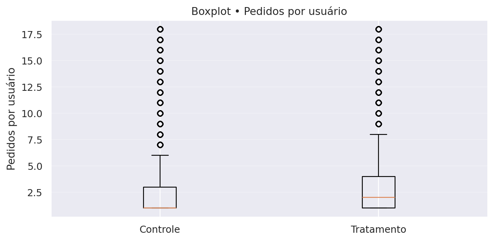

# Relatório Final – Impacto da Campanha de Cupons

## 1. Contexto
O iFood testou uma campanha de cupons com um grupo de usuários selecionados (grupo teste), enquanto outro grupo similar não recebeu o benefício (grupo controle).  
O objetivo do experimento foi avaliar se o cupom aumentaria o engajamento e o gasto dos usuários, além de verificar a viabilidade financeira da iniciativa.

**Glossário**
- **Mediana:** valor típico por cliente (menos sensível a casos extremos).
- **p95:** nível alto esperado (apenas ~5% dos clientes ficam acima disso).
- **Heavy users (≥3):** parcela de clientes frequentes.
---

## 2. Principais Resultados da Campanha

### 2.1 Engajamento e Vendas

**Tabela 1 – Sumário por grupo (medianas, p95 e heavy users).**  

| Grupo | Usuários | Mediana GMV | Mediana pedidos | Mediana AOV | p95 GMV | p95 pedidos | p95 AOV | % Heavy Users (≥3) |
|---:|---:|---:|---:|---:|---:|---:|---:|---:|
| Sem Cupom | 357261 | 66.2 | 1 | 40.85 | 457.40 | 9 | 100.6 | 30.71% |
| Com Cupom | 442676 | 79.8 | 2 | 41.00 | 507.19 | 10 | 99.80 | 36.93% |

- **Pedidos por usuário**: aumento de **+100%** no grupo que recebeu o cupom.
- **GMV por usuário (valor gasto no app)**: crescimento de **+20%** com o cupom.
- **Ticket médio (AOV)**: permaneceu estável, em torno de **R\$100 por pedido**.
- **Heavy users (≥3 pedidos no período)**: cresceram de **31%** para **37%** com o cupom.

**Figura 1 – Medianas por grupo (GMV, Pedidos, AOV).**  

**Figura 2 – Distribuição de pedidos por usuário (controle vs tratamento).**  

**Figura 3 – Boxplots (robustos a outliers) por grupo.**  
a) GMV por usuário  
  

b) Pedidos por usuário  
  

c) AOV por usuário  
     

**Interpretação:**  
O cupom não aumentou o valor de cada pedido, mas levou os usuários a **pedirem com mais frequência**, elevando o gasto total.  
Isso reforça o cupom como alavanca de engajamento e hábito de consumo, e não como impulsionador de ticket médio.

---

### 2.2 Sustentabilidade Financeira
Premissas adotadas:  
    - Valor do cupom: **R$10**, pago pelo iFood.  
    - Taxa de uso do cupom: **30%**.  
    - Comissão média do iFood (take rate): **23%** sobre o valor dos pedidos.  

- **Receita incremental total (comissões adicionais):** R$1,74 milhão.  
- **Custo total dos cupons concedidos:** R$1,33 milhão.  
- **Lucro incremental total (receita − custo):** R$416 mil.  
- **Lucro incremental por usuário tratado:** R$0,94.  
- **LTV (valor estimado de longo prazo por cliente):** R$34,6.  
- **CAC (custo de aquisição via cupom):** R$10.  
- **Relação LTV/CAC:** 3,5 → saudável.  
- **ROI (%) ≈ 31,35%**

**Tabela 2 – Indicadores financeiros (base).**

| Métrica                         | Valor          |
|---                              |---             |
| Receita incremental total       | R$1,74 milhão  |
| Custo total dos cupons          | R$1,33 milhão  |
| **Lucro incremental total**     | **R$416 mil**  |
| **Lucro incremental por usuário** | **R$0,94**   |
| LTV                             | R$34,6         |
| CAC                             | R$10           |
| LTV/CAC                         | 3,5            |
| **ROI (%)**                     | **31,35%**     |

**Nota sobre o LTV:**  
O cálculo do LTV (Lifetime Value) é normalmente utilizado em horizontes mais longos, acompanhando a evolução do cliente ao longo de vários meses ou anos. No nosso caso, os dados disponíveis cobrem apenas o período do experimento, de modo que o LTV foi aqui estimado a partir desse intervalo restrito.  
Mesmo assim, a métrica foi incluída porque oferece uma boa referência de potencial de retorno por cliente e permite compará-lo com o CAC. Ou seja, ainda que a estimativa seja mais conservadora e não capture todo o ciclo de vida real do cliente, ela ajuda a reforçar a análise de viabilidade financeira no contexto deste case.

**Interpretação:**  
O investimento em cupons trouxe **retorno positivo** para o iFood.  
Cada real gasto com cupons gerou aproximadamente **R\$3,50 de valor de cliente a longo prazo**, indicando uma estratégia financeiramente sustentável.

---

### 2.3. Conclusões
- A campanha de cupons foi **bem-sucedida em aumentar a frequência de pedidos e o GMV por usuário**.  
- O ticket médio permaneceu estável, mas o maior engajamento levou a uma **receita incremental relevante**.  
- Financeiramente, a ação se mostrou **viável e sustentável**, com ROI positivo e excelente relação **LTV/CAC**.  
- O cupom deve ser entendido como uma alavanca de **engajamento e recorrência**, mais do que de aumento de ticket médio.

---

### 2.4. Recomendações e Nova Proposta de Teste A/B

Os resultados da análise mostraram que os cupons, da forma como foram aplicados, aumentaram o número de pedidos e o GMV, mas não alteraram o valor médio por pedido (AOV). Além disso, observamos que até usuários com alto engajamento (heavy users) utilizaram os cupons, o que reduz a eficiência da campanha.

Diante disso, recomendamos **ajustes na estratégia** antes de repetir a ação:

#### 1. Segmentação mais inteligente
- **Evitar heavy users**: clientes que já compram frequentemente tendem a usar o cupom, mas não aumentam seu gasto médio. Assim, o investimento não gera valor incremental.
- **Foco em clientes inativos ou de baixa frequência**: direcionar cupons a esse grupo pode aumentar a base ativa e gerar maior retorno sobre o investimento.

#### 2. Diferenciar o tipo de cupom
- **Cupom com gasto mínimo**: exemplo, "R\$10 de desconto para compras acima de R\$40”. Esse modelo incentiva aumento do ticket médio, combatendo o resultado neutro que vimos no AOV.
- **Frete grátis**: alternativa que pode ser mais atrativa em alguns perfis de consumidores e incentivar novas compras.

#### 3. Nova proposta de teste A/B
Para validar essas hipóteses, sugere-se um desenho de experimento com três grupos:

- **Grupo Controle**: sem cupom.  
- **Grupo 1**: cupom fixo de \$10 com gasto mínimo de R\$40.  
- **Grupo 2**: cupom de frete grátis com gasto mínimo de R\$30.  

**Público-alvo do teste:** clientes inativos ou de baixa frequência.

#### 4. Métricas de avaliação
- **Pedidos por usuário** (engajamento).  
- **GMV incremental** (crescimento de receita).  
- **ROI da campanha** (retorno financeiro líquido).  
- **Taxa de reativação** (quantos clientes voltaram a comprar).  

Com essa abordagem, será possível avaliar se os cupons funcionam não apenas como incentivo imediato, mas também como alavanca de crescimento sustentável para o negócio.

---

## 3. Segmentação de usuários

### 3.1. Critérios de segmentação e racional

**Objetivo.** Agrupar clientes com comportamentos semelhantes para direcionar benefício, mensagem e canal, aumentando engajamento/retenção e otimizando custo de cupom.

**Critérios utilizados:**
- **Frequência (Heavy user):**  
  - *Definição*: **heavy** (≥ 3 pedidos no período) vs **não-heavy** (< 3).  
  - *Racional*: frequência é um preditor direto de valor; separar quem já tem hábito de compra de quem ainda está “em formação”.
- **Plataforma de origem:** **Android**, **iOS** e **Desktop**.  
  - *Racional*: o comportamento por dispositivo/canal difere (tamanho do ticket, fricção de checkout, jornada).
- **RFM (Recency–Frequency–Monetary):** códigos **111–555** (1=baixo, 5=alto em cada eixo).  
  - *Racional*: permite distinguir desde “recente-pouco-baixo ticket” (ex.: 111) até “recente-muito-alto ticket” (ex.: 555) para graduar o incentivo.
- **Novo vs recorrente:** sinalizamos **novo** quando disponível, porém, na base utilizada, o volume de “novo” é residual (amostra focada em quem já comprou). Mantemos como **exploratório** até incorporar usuários que ainda não pediram (para medir 1ª compra de fato).

**Inserir figuras de referência (médias para visão geral e box/hist para forma da distribuição):**  
- **Barras – médias por segmento:**  
  - [INSERIR FIGURA: `outputs/figs_segments/bars_heavy.png`]  
  - [INSERIR FIGURA: `outputs/figs_segments/bars_new.png`]  
  - [INSERIR FIGURA: `outputs/figs_segments/bars_platform.png`]

- **Boxplots – heavy_user (com e sem winsor 1%):**  
  - [INSERIR FIGURA: `outputs/figs_segments/box_heavy.png`]  
  - [INSERIR FIGURA: `outputs/figs_segments/box_heavy_w.png`]
- **Histogramas – por segmento (exploratório):**  
  - [INSERIR FIGURA: `outputs/figs_segments/hist_new.png`]  
  - [INSERIR FIGURA: `outputs/figs_segments/hist_platform.png`]

---

### 3.2. Resultados do A/B por segmento e recomendações

**1) Frequência (Heavy vs Não-heavy)**  

**Tabela 3 – Medianas por segmento (Heavy vs Não-heavy)**

| Segmento   | Usuários (Trat.) | GMV mediano (Ctrl → Trat) | Δ GMV | Pedidos medianos (Ctrl → Trat) | Δ Pedidos |
|---|---:|---:|---:|---:|---:|
| Não-heavy  | 34.929 | 47,00 → 50,00 | **+3,00** | 1 → 1 | 0 |
| Heavy      | 20.439 | 205,60 → 208,20 | **+2,60** | 5 → 5 | 0 |
  - **Não-heavy**: ganho claro em **GMV/usuário e pedidos/usuário** com o cupom; AOV estável.  
  - **Heavy**: efeito marginal (quase nulo) dentro do grupo.  
  - O grupo tratado tem **mais heavy users** (~37% vs ~31%), o que também puxa a média geral para cima (efeito de composição).
- **Ações sugeridas:**  
  - **Direcionar** o cupom em **não-heavy** (1–2 pedidos) para conduzir ao 2º→3º pedido.  
  - **Reduzir frequência/valor** do cupom para **heavy** (≥ 3) para evitar canibalização.
- **KPI alvo:** aumento da **taxa de heavy users** (≥ 3) e do **GMV mediano** entre não-heavy, com AOV estável.

**2) Plataforma (Android / iOS / Desktop)**  

**Tabela 4 – Medianas por segmento (Plataforma)**

| Plataforma | Usuários (Trat.) | GMV mediano (Ctrl → Trat) | Δ GMV | Pedidos medianos (Ctrl → Trat) | Δ Pedidos |
|---|---:|---:|---:|---:|---:|
| Android | 23.632 | 59,00 → 69,80 | **+10,80** | 1 → 2 | **+1** |
| Desktop | 7.939  | 63,20 → 73,60 | **+10,40** | 1 → 2 | **+1** |
| iOS     | 23.336 | 77,80 → 94,00 | **+16,20** | 1 → 2 | **+1** |

  - **Desktop** e **iOS** respondem melhor (maior ganho por usuário); **Android** responde, mas com retorno menor.  
  - Em mediana, Android e Desktop avançam de **1→2 pedidos**; iOS aumenta GMV mediano.
- **Ações sugeridas:**
  - **Priorizar** campanhas em **Desktop e iOS** (melhor retorno).  
  - Em **Android**, testar **cupom menor** ou **gatilhos mais precisos** (ex.: ofertar no 2º carrinho ou após período sem compra), para elevar eficiência.
- **KPI alvo:** **ROI por usuário** do segmento ≥ 0 e crescimento do **p95** sem queda de AOV.

**3) RFM (111–555)**  

**Tabela 5 – RFM (Top 5 por população do Tratado)**

| RFM | Usuários (Trat.) | GMV mediano (Ctrl → Trat) | Δ GMV | Pedidos medianos (Ctrl → Trat) | Δ Pedidos |
|---|---:|---:|---:|---:|---:|
| 555 | 5.391 | 409,3 → 415,2 | **+5,9** | 9 → 9 | 0 |
| 111 | 3.192 | 25,2 → 25,9   | **+0,7** | 1 → 1 | 0 |
| 112 | 2.904 | 44,0 → 44,5   | **+0,5** | 1 → 1 | 0 |
| 211 | 2.310 | 25,1 → 25,0   | **−0,1** | 1 → 1 | 0 |
| 455 | 2.054 | 343,6 → 332,8 | **−10,8** | 7 → 7 | 0 |

  - Dentro de cada célula RFM, o ganho tende a ser pequeno; o aumento global vem da **maior participação** de células de alto valor no grupo tratado (mix).  
- **Ações sugeridas:**  
  - **Baixo RFM (11\*, 21\*, 31\*)**: cupom mais **agressivo** para gerar 2º e 3º pedidos.  
  - **Médio RFM (4\*4, 45\*)**: cupom **moderado**, orientado a frequência.  
  - **Alto RFM (54\*, 55\*)**: cupom **baixo/ocasional**, evitando gastos onde ganhos já existem.  
- **KPI alvo:** progressão de faixas (ex.: 11\*→12\*/13\*; 2\*→3\*), aumento de **frequência mediana** nas faixas baixas.

**4) Novo vs Recorrente (limitação atual)**  

**Tabela 6 – Medianas (Novo vs Recorrente)**

| Segmento | Usuários (Trat.) | GMV mediano (Ctrl → Trat) | Δ GMV | Pedidos medianos (Ctrl → Trat) | Δ Pedidos |
|---|---:|---:|---:|---:|---:|
| Recorrente | 55.348 | 66,00 → 79,60 | **+13,60** | 1 → 2 | **+1** |

- **O que vimos:** o sinal de “novo” é residual na amostra (quase todos já compraram anteriormente), então a “conversão=1,0” é espúria.  
- **O que fazer:** incluir **usuários sem pedido** na base de teste (grupo de controle e tratado) para medir **1ª compra**; só então definir política específica para “novos”.

---

### 3.3. Próximos passos de produto (teste direcionado)

1. **Teste A/B estratificado** por **heavy_user** e **plataforma**, com **valor de cupom variável** (ex.: Android R\$6–8; iOS/Desktop R\$10–12).  
2. **Gatilho de progressão** para não-heavy (ofertar após o 1º ou 2º pedido, ou após X dias sem compra).  
3. **Métricas de sucesso**:  
   - Primárias: **GMV mediano por usuário** e **taxa de heavy users**, por segmento.  
   - Financeiras: **Lucro incremental total** e **ROI(%)** por segmento.  
4. **Guardrails**: manter **AOV estável** e não aumentar cancelamentos.

